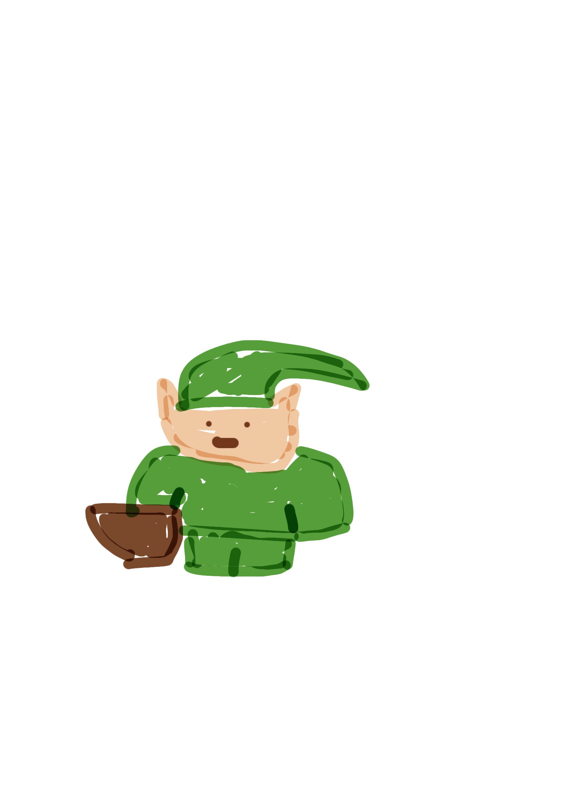
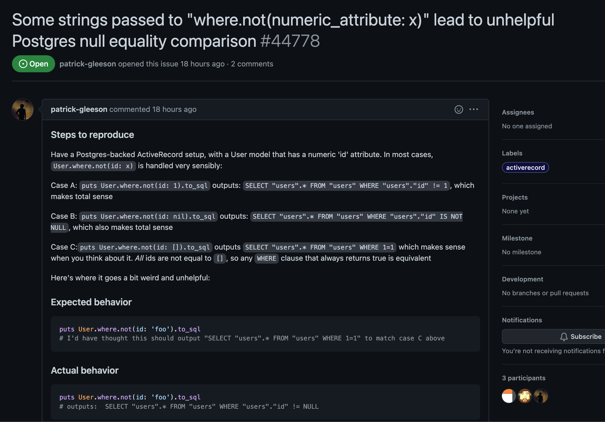
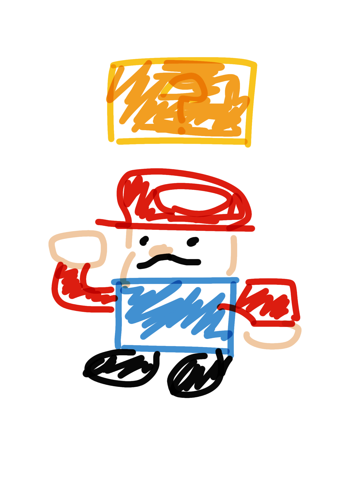
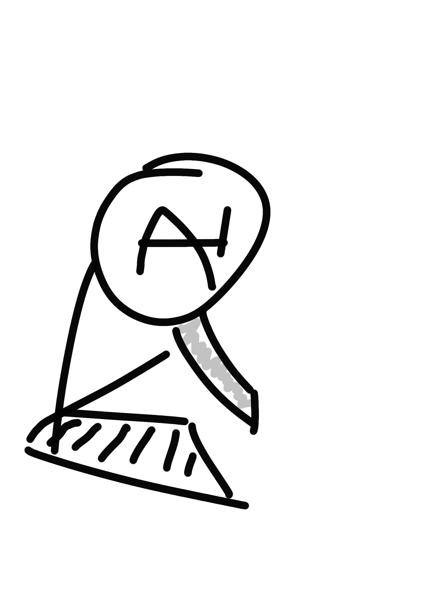
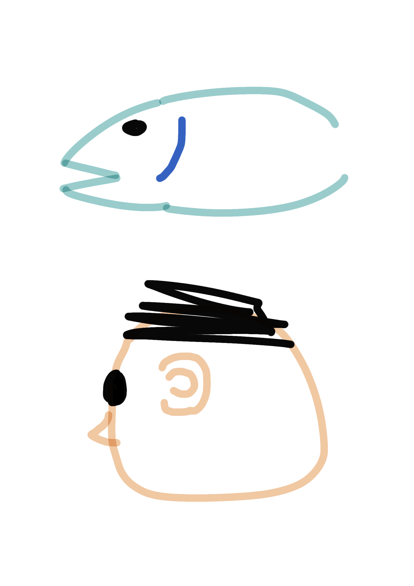

# It's dangerous to go alone! Take this!
## On finding your way in a code that's new to you

---

# Why did I write this talk?
<!--
- I like talking about tooling
- I want to empower others
- I wish someone had told me before
- Make up for the terrible legacy I have left and continue to
- This is a quick overview of issues and solutions for finding my way I have found
 -->
---

# What do we need to find our way
- Where can we start our journey?
- Getting around
- Retelling the story

---
# Where can we start our journey?
---

# What are good entry points?
- Have a problem we want to solve
<!--
  - We are on a quest, we can't spend time reading all the lore
  - Route finding has been more successful for me than consuming content, YMMV
  - Trying to eat the whole elephant is hard because connecting the dots is what lets us get a foot hold
 -->
- We want to start with a place that touches the least amount of code we don't care about
---
- Is there a way we can find a test?
- Is there a way we can activate it through the UI?
- Is there a pretty specific string we can start looking for in the code?

---

<!-- 
This is a random issue I found on the GH today, it will serve as our example of trying out some stuff to get around
-->

---
# Getting around in Ruby
---

# How does Ruby get in the way?
The design of Ruby makes it hard for tools that don't run the code (static analysis) to follow the code around
<!-- 
- Defining methods at runtime
- method_missing
- autoloading
-->

---

# Jumping with static tools
- ctags 
- language servers - Solargraph
<!--
- ctags is a program that will generate locations of symbols and allows you to jump them with your editors integration
- language server - Microsoft created the Language server protocol for VSCode, allows IDE like experiences in editors that incorporate it, one of them being GoToDefinition
 -->
---

# Searching and Guessing
- project wide string search
  - def needle_method
  <!-- the static tools fail often enough I have resort to doing this about half the time
  demonstrate searching -->
---
# Guessing continued
- Automating common searching
- (neo)vim - anyjump.vim
- VSCode - vscode-dumb-jump
  <!--
  - searching from build_where
  - try bunch of predefined regexes with this symbol and show me the hits
  -->
---
# Landmarks
- Rails conventions 
- project conventions
- alternate file finders rails.vim, vim-projectionist, VSCode - alternate-file 
<!-- 
demonstrate
moving to a test
moving to a view
 -->
---
# Ruby Tools
## A solution to Ruby is more Ruby
- Debugger driven development
- Find an entry point to drop a debugger in
- Step through executing code

---

# Pry
- Pry gem
- show-source command 
- can let you trace through metaproq
<!-- demo test finding, show-source -->
---

# Lost in the library?
- bundler gem
- command `bundle open <library>` and drop a binding
---

# Environmental Changes
- Type Ruby with RBS
<!-- 
this is going to be a massive investment but I think with the success of Typescript
this is one of the most high impact ways to globally improve the mechanics of getting around in Ruby and solving other classes of problems
-->

---
# Retelling the story
---

# How do we make sure our story is right
- What is our vocabulary?
- Ask someone
- Building maps

---
# What is our vocabulary?
What level are we talking about?
- general progamming and technology terms
- Language specific terms
- Framework or Pattern specific terms
- Domain specific terms
<!-- 
how do we understand these words and have them encoded in our code base?
is there a glossary? can we start building one
 -->

---
# Ask someone
---

# Why am I asking?
  - I need a shortcut vs Put me on the path
  - Avoiding XY problems
  <!-- 
  XY problems are trying fix your solution.
  Make clear your intent
  -->

---

# Why am I not asking?
- Unproductive
  - I don't want to appear like I don't get it
  - They must be busy
- Productive
  - We want to understand it our own way and clarify our assumptions
  - What is the fastest way we can prove our model wrong?
---

# Building Maps
Reading and understanding code that is hard to understand is less like geography and more like archaeology.
A complete understanding will be more like a story than a map.

---
# Understand our assumptions
- Evolutionary pressure on code to become one thing when it started as another
- git commit message archaeology
---

<!--
- More recently the things I know about evolution are from playing Pokemon with my son
- The same bones that become gills in our fishy ancestors become tiny bones in our ears.
- This blew my mind when I found out about it.
- How come gills didn't become lungs. I don't breathe with my ears?
- It's more that the gill material disappeared when it became useless and the bones could move elsewhere to become useful since it's so close to our brain and other sensory organs like the eyes. The lungs and gut share ancestry.
- When our mental models collide with reality we really need to take a step back and understand the story.
-->

---

# How we can empower those that come after us by changing the environment
- Empower others to go on code adventures
<!-- suggest tools, inside and outside the code, guides, share our workflows, code reading exercises -->
- Leave better road signs for our future selves
<!-- name things intentionally, leave time to clean up after ourselves-->
- Be kind to ourselves and understand the pressures we and our past selves have been under

---

# Thanks!
Allen Hsu
github: aldhsu
linkedin.com/in/allendhsu

---

# The Lookout Way

- We build care management platform that empowers our users to focus on what they do best
- Our values are calm, pragmatic, empowering and human
- We are hiring!
- https://www.linkedin.com/company/the-lookout-way
